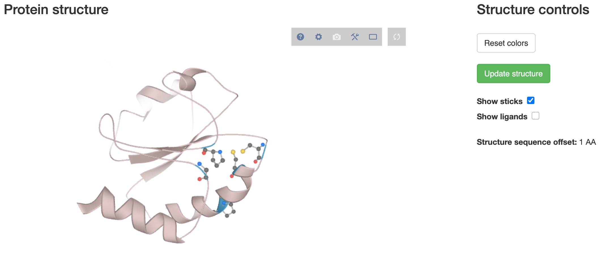

# q2-protein-pca

QIIME 2 plugin for PCA analysis of protein sequences, as described by Wang & Kennedy (see below).

## Installation

Create a new conda environment and install required dependencies:

```
conda create -y -n protein-pca
conda activate protein-pca
conda install \
  -c conda-forge -c bioconda -c qiime2 -c defaults \
  qiime2 q2cli q2templates q2-types q2-alignment q2-emperor "pandas==0.25.3"
```

This plugin requires new types and formats to work with protein sequences. Before those are officially added to the
q2-types plugin, you will need to install q2-types from the respective branch by doing:

```
pip install https://github.com/misialq/q2-types/archive/protein-seqs.zip
```

Finally, install q2-protein-pca:

```
pip install git+https://github.com/bokulich-lab/q2-protein-pca.git
```

To see actions available within the q2-protein-pca plugin:

```
qiime dev refresh-cache
qiime --help
```

## Usage

This repository contains a sample dataset of thioredoxin sequences that can be used to try out the plugin's functionality.
The data is located under `sample_data`: `thioredoxin-seqs.fasta` contains 22 protein sequences and `thioredoxin-metadata.tsv`
contains corresponding metadata (to aid with the visualisation).

First, we import the data into a QIIME 2 artifact:

```
qiime tools import --input-path thioredoxin-seqs.fasta --output-path thioredoxin-seqs.qza --type "FeatureData[ProteinSequence]"
```

We can generate a multiple sequence alignment, using the `mafft` action as follows:

```
qiime protein-pca mafft --i-sequences thioredoxin-seqs.qza --o-alignment thioredoxin-aln.qza
```

This sequence alignment needs to be ranked to convert amino acids in letter representation to their respective ranks, 
as described by Wang & Kennedy:

```
qiime protein-pca rank-alignment --i-sequences thioredoxin-aln.qza --o-ranked-alignment thioredoxin-ranked.qza
```

Next, we perform principal component analysis on the rank matrix received by running the previous command. This should generate 
two types of outputs - PCA scores and PCA loadings (both of which can be visualised later):

```
qiime protein-pca pca --i-ranks thioredoxin-ranked.qza --o-pca-scores thioredoxin-pca-scores.qza --o-pca-loadings thioredoxin-pca-loadings.qza
```

Additionally, we generate position mapping between amino acid positions in the alignment and their respective positions
within original protein sequences:

```
qiime protein-pca map-positions --i-aligned-sequences thioredoxin-aln.qza --o-mapped-positions thioredoxin-mapped.qza
```

To visualise PCA scores we can use `plot` action from the `emperor` plugin. This will generate a plot on which we can 
visualise how different sequences group together. This is where we require the metadata file - in this example we will
be able to see how thioredoxins from different kingdoms/domains of life cluster together:

```
qiime emperor plot --i-pcoa thioredoxin-pca-scores.qza --m-metadata-file thioredoxin-metadata.tsv --o-visualization thioredoxin-pca-scores.qzv
```

The more interesting question, however, is which amino acids within thioredoxin's sequence contribute most and least to this variation.
In other words, which thioredoxin residues make the protein sequence to be classified as bacterial vs. animal or which residues
are most conserved within the sequence (e.g. could we identify active center amino acids?). To do that we can analyse PCA
loadings by running the following command:

```
qiime protein-pca plot-loadings --i-pca-loadings thioredoxin-pca-loadings.qza --i-positions-mapping thioredoxin-mapped.qza --o-visualization thioredoxin-pca-loadings.qzv
```

The scores plot obtained in the first visualisation should look something like:


Different colours represent different kingdoms. Using
the second plot we can identify the most conserved positions within the thioredoxin sequence:


On the visualisation page you can select the level of conservation you are interested in: setting to 90% would highlight all positions
whose distance from the PC space origin does not exceed more than 10% of the distance to the furthest point. Additionally, 
selecting a protein id from the drop-down menu will show you in the table below which amino acid positions in that sequence
were within that level (highlighted in red). In this example you can see how the two cysteines in thioredoxin's active centre 
are strictly conserved in all organisms (positions 33 and 36 in *E. coli*'s thioredoxin, ADX53128.1). Also, the two prolines 
important for maintaining thioredoxin's redox properties and stability appear as (nearly)-strictly conserved (positions 41 and 77).

### Protein structure overlay

If there is an exisitng protein structure deposited in the [Protein Data Bank](https://www.rcsb.org/) that you would like to use to show 
the conserved positions, you can do so by specifying two additional parameters: 
* `--p-pdb-id` - a four letter code representing the ID of a structure file you want to fetch from PDB (e.g. _2trx_) 
* `--p-nterm-offset` - a number indicating how many amino acids are missing from the N-terminus in the PDB structure (the default is 1
as most often the initial methionine is not present; you should increase this number if a larger piece of the N-terminus was removed; if
the methionine is present, set to 0)

Our command to generate this visualisation would now look like:

```
qiime protein-pca plot-loadings --i-pca-loadings thioredoxin-pca-loadings.qza --i-positions-mapping thioredoxin-mapped.qza --o-visualization thioredoxin-pca-loadings.qzv --p-pdb-id 2trx --p-nterm-offset 1
```

Once you open the visualisation you should see an additional panel containing your protein structure of choice:



Initially nothing will be overlayed - above that panel you should first select an accession number corresponding to the structure fetched.
Clicking _Update structure_ will re-render the 3D panel. You will need to _update structure_ every time after adjusting the conservation threshold -
 that is to prevent constant re-rendering of the visualisation (could be slow for large and complex proteins).
 
**Important:** remember to select the correct accession id using the dropdown next to the PCA plot. Otherwise the numbering of residues highlighted 
in the structure may be wrong. 

For more details about the ranking method that this plugin implements, head to [Wang & Kennedy (2014)](https://doi.org/10.1007/s10969-014-9173-2). If you want to see
another, more realistic example of how this method can be applied, check out [Ziemski et al. (2018)](https://doi.org/10.7554/eLife.34055) which analysed an unknown, actinobacterial
protein family in the context of a large AAA+ protein superfamily. If you want to read more about thioredoxins themselves, you can start by going through
this review: [Collet & Messens (2010)](https://doi.org/10.1089/ars.2010.3114).

## References
* B. Wang & M.A. Kennedy (2014). Principal components analysis of protein sequence clusters. *J Struct Funct Genomics*, 15(1), 1-11. [doi:10.1007/s10969-014-9173-2](https://doi.org/10.1007/s10969-014-9173-2)
* M. Ziemski, A. Jomaa, D. Mayer, S. Rutz, C. Giese, D. Veprintsev & E. Weber-Ban (2018). Cdc48-like protein of actinobacteria (Cpa) is a novel proteasome interactor in
mycobacteria and related organisms. *eLife* 7, e34055. [doi:10.7554/eLife.34055](https://doi.org/10.7554/eLife.34055)
* J.F. Collet & J. Messens (2010). Structure, Function, and Mechanism of Thioredoxin Proteins. *Antioxidants & Redox Signaling* 13(8). [doi.org/10.1089/ars.2010.3114](https://doi.org/10.1089/ars.2010.3114)
* D. Sehnal, M. Deshpande, R.S. Vařeková, S. Mir, K. Berka, A. Midlik, L. Pravda, S. Velankar & J. Koča (2017). LiteMol suite: interactive web-based visualization of large-scale macromolecular structure data. 
*Nat Methods* 14, 1121-1122. [doi:10.1038/nmeth.4499](https://doi.org/10.1038/nmeth.4499)
* [PDB LiteMol](https://github.com/PDBeurope/pdb-lite-mol) 